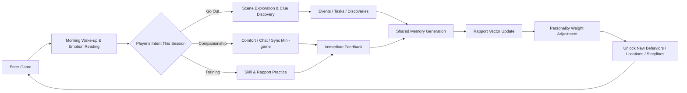
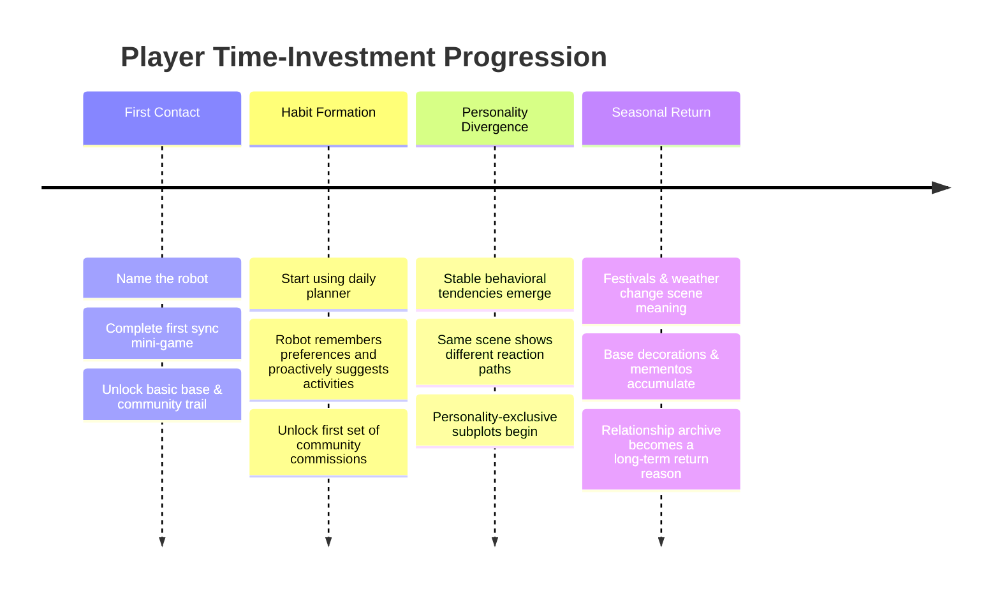
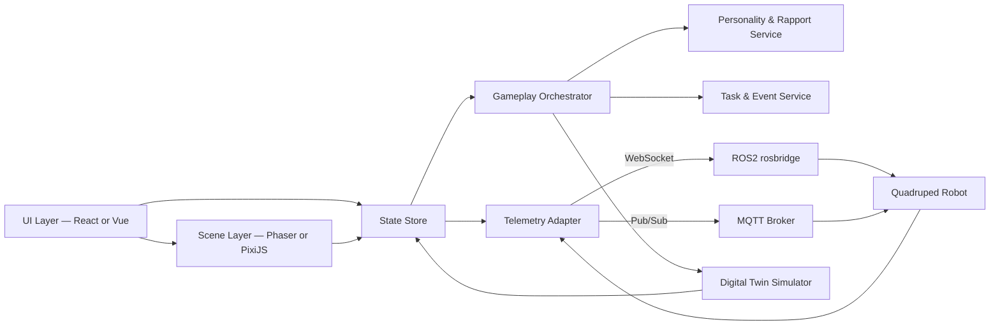

# Quadruped Companion Robot Front-End Game Prototype — Gameplay Design Research Report

## Executive Summary

The worst directions for this product are "a watered-down action game" or "a chat-only virtual pet." Instead, it should be a **Companion Diorama**: players enter the world through short, frequent daily interactions; spend moderate-length sessions exploring and co-resolving events ("doing things together with the robot"); and deepen the experience into a long-term relationship through seasons, personality divergence, and shared memories. If the user's mention of "Mario Adventure" is read primarily as *Super Mario Odyssey*-style sandbox exploration, what to borrow is not high-end rendering but **high-density curiosity rewards**. If you line up *Pokémon*, *Pokopia*, *Stardew Valley*, and *Don't Starve*, their true commonalities are: multi-path choices, calendar-driven reasons to return, stateful worlds, sustainable relationship growth, and "something a little new every time you log in." (cite)

From motivation research and human-robot interaction (HRI) studies, the drivers of long-term engagement are not reward frequency alone but the simultaneous satisfaction of **autonomy, competence, and relatedness**. Repeated interaction also raises users' subjective ratings of a robot's sociality, warmth, and capability, and promotes more self-disclosure and higher-quality perceived relationships. Meanwhile, long-term HRI and companion-robot research consistently emphasizes that **memory, personalization, empathy, privacy control, and interaction boundaries** ("when to be proactive, when to hold back") are more critical for long-term retention than one-time novelty. (cite)

Therefore, the recommended prototype direction is not "combat-driven" but a **moderate-duration companion-exploration loop** as the backbone: in a 20–40 minute session, the player and the quadruped robot in a lightweight front-end scene complete observation, probing, coordination, discovery, emotional care, and task resolution together. Short loops pull players back; long loops ensure that both the relationship and the world leave lasting marks. Combining *Pokopia*'s foregrounding of a daily planner and time-limited events, *Stardew Valley*'s calendar rhythm for characters and festivals, *Mario Odyssey*'s exploration-reward density, and *Don't Starve*'s world-state-driven unpredictability is what will make users willing to invest long-term time in the "human companionship feature." (cite)

For retention, we recommend **gentle but persistent recall** rather than strong guilt, punishment, or decay-based "neglect-punishes-your-pet" logic. Human-robot attachment research and companion-robot ethics discussions note that companion robots can indeed form attachments and alleviate loneliness, but also carry risks of dependency, reduced human contact, and emotional impact if the robot is taken away. This means the prototype—even if eventually commercialized—should never make "repair the relationship," "erase neglect," or "unlock emotional comfort" into pay points. (cite)

---

## Reference Works & Design Orientation

**Pokémon** gives you not the surface-level "collect more is better" structure but a framework where **multi-path adventure and companionship growth coexist**. *Pokémon Scarlet/Violet* official materials describe it as the series' first open-world RPG, emphasizing the player's freedom to choose the order in which to pursue different storylines. Contemporary trainer guides explicitly list "walking together, battling without letting them faint, and playing together during picnics" as ways to grow closer to Pokémon. In *Pokémon Pokopia*, this logic shifts further toward slow living: the official homepage defines it as a relaxing life-simulation game centered on crafting, creating, and building, highlighting "build your own Pokémon paradise" and "invite Pokémon and friends to visit." Official news and promotions showcase a daily planner, time-limited events, and micro-interactions like jump-rope with Bulbasaur or having Charmander light a fire. The most valuable lesson for your quadruped robot front-end game is this: **relationships should not be a separate numerical system but should be embedded in the world's activities themselves.** (cite)

**Stardew Valley** provides a **calendar-driven long-term companionship experience**. The official Steam copy emphasizes 30+ unique characters, each with a schedule, birthday, and unique mini-storylines, who say new lines across weekly and yearly cycles. Seasonal festivals, cave exploration, skill growth, fishing, museum donations, cooking, and home customization together form a high-freedom daily schedule. More importantly, the 1.6 update doubled down on long-term re-engagement: new festivals and environmental events, more dynamic NPC dialogue, multiple pets, pet gift-giving, quest-reward exchange machines, daily random blessings, and biennial festival content. For your project, this means **companionship should not rely solely on dialogue windows** but on "characters have lives, scenes have rhythms, relationships have echoes." (cite)

**Don't Starve**'s key contribution is not high-pressure survival but a **stateful, composable, story-generating world**. Klei officially describes it as a wilderness survival game filled with science and magic; the core is entering an unfamiliar world, gathering resources, and building and exploring in your own survival style. Expansions continuously extend the world-state space through seasons, biomes, creatures, and new challenges; *Hamlet* in particular integrates "city life, trading, home renovation, ruin exploration, and seasonal new recipes" into the same survival/discovery framework. For a quadruped companion robot, this means using "the world changes" methods to create emergent events, but reducing punishment intensity from "hard failure" to "soft narrative tension." (cite)

If "Mario Adventure" is understood as *Super Mario Odyssey*, the transferable value is **high-density exploration payoff and localized ability switching**. Nintendo's official pages describe it as a sandbox-style 3D Mario adventure; Power Moons are abundant but vary in difficulty; players freely explore different Kingdoms, and rewards include not just progression resources but Regional Coins, Outfits, Stickers, and Souvenirs—some outfits even let Mario access special locations. Translated to your project, the conclusion is clear: players don't need a giant map; they need **a meaningful discovery every 5–10 clicks/actions**, and these discoveries should genuinely change robot behavior, scene permissions, or shared memories. (cite)

For the quadruped robot itself, we must also introduce the design perspective of **animal companionship rather than humanoid companionship**. HRI research has long proposed that social animals—especially dogs—can provide rich reference models for social robot design, since human-animal interaction has matured experience across a wide range of conditions. However, more recent PLOS research shows that even advanced AIBO falls short of real dogs in the short term on oxytocin changes, self-reported attachment, and social companionship ratings. A more reasonable direction may not be to fully replicate a dog but to let the robot play a **supplementary, technology-enhanced partner role**. For your game design, this means: the quadruped robot should not be written as a "perfect electronic dog" but should be shaped as a **unique partner combining animal-style companionship cues with robot-style capability features.** (cite)

---

## Core Loops & Retention Mechanics

We recommend structuring the prototype as **three nested loops**. The innermost is the **Companion Action Loop**: spot a clue → interpret the robot's state → choose a response → jointly complete an action → receive immediate feedback. The middle layer is the **Scene Exploration Loop**: enter a scene → trigger an event or task → use the robot's personality and abilities to discover hidden points → bring back memories and resources. The outer layer is the **Relationship Season Loop**: as interactions accumulate, the robot's personality parameters, memory bank, scene permissions, shared home, and community relationships all undergo visible changes. This layering simultaneously satisfies autonomy, skill mastery, and relational bonding—the three keys to long-term gaming motivation. It also aligns better with the trajectory emphasized in long-term companion-robot research: "relationship quality gradually improves across repeated sessions." (cite)

All three loop forms are viable, but for the goal of "lightweight front-end prototype, emphasizing human companionship, wanting players willing to invest long-term," the best fit is the **Moderate-Duration Companion Exploration Diorama**: it can accommodate companionship features without requiring heavy combat, heavy building, or heavy networking support. The table below compares three candidate skeletons; we recommend the moderate-duration plan as the trunk, then layer on short-loop recall and long-loop seasonal deepening on top. (cite)

| Loop Scheme | Typical Duration | Structure | Main Time-Investment Points | Advantages | Risks |
|---|---:|---|---|---|---|
| Light Companionship Micro-loop | 5–10 min | Greeting → one companion action → one small event → memory record | Check-in-style relationship maintenance, diary, reminders | Extremely easy to return to; suits mobile & notification recall | Easily devolves into a check-in tool; insufficient companionship depth |
| Companion Exploration Diorama | 20–40 min | Choose scene → explore together → event/task → return home & debrief → personality micro-adjustment | Relationship growth, clue collection, scene replayability | Most balanced—has both companionship and "playability"; suits front-end prototype as primary mode | Requires good content-density control, or it will feel repetitive |
| Seasonal Shared-Life Loop | 45–90 min, continuous progression | Weekly plan → multi-scene progression → festivals/community changes → long-term personality branching | World restoration, community relationships, home-building, seasonal archives | Highest long-term value; most likely to form "my robot" feeling | Higher cost at prototype stage; if content is thin, it drags |

More concretely, retention should come not from check-ins alone but from four kinds of "come back and see" reasons. **Daily return** comes from the planner, emotional greetings, and short events. **Weekly return** comes from festivals, leaderboard-style mini-games, or new commissions. **Seasonal return** comes from weather, ecology, scene structure, and storyline phase changes. **Relationship return** comes from the robot remembering, changing, and responding to you in new ways. In real companion-robot cases, frequent but low-barrier micro-interactions have been shown to drive high touch frequency, while long-term HRI research shows that across multiple sessions, users' ratings of the robot's comforting, warmth, and sociality may continue to rise. So the prototype's job is not to extend single-session length infinitely but to ensure that **every login leaves a new, recallable relationship trace.** (cite)

---

## Detailed System Design

### Rapport Growth System

We recommend avoiding a single "affinity bar" in favor of one public metric—"Rapport Level"—overlaid with four hidden vectors: **Security**, **Understanding**, **Synergy**, and **Shared Memory Density**. Security grows from comforting, regular routines, and giving correct responses when the robot is distressed. Understanding grows from reading its preferences and making choices that make it "feel understood" in dialogue and scenes. Synergy grows from synchronized actions, cooperative puzzles, rhythm mini-games, and two-way collaboration during exploration. Shared Memory Density grows from regular debriefs, photo/voice/sticker collections, and the robot proactively bringing up past experiences. The rationale comes from long-term HRI research showing that repeated interaction increases self-disclosure, perceived sociality, interaction quality, and comfort; personalization and memory are core conditions for sustaining long-term engagement, not mere add-ons. (cite)

### Personality Divergence System

We recommend using four personality axes that are more perceivable to players rather than exposing Big Five numerical values directly: **Explorer ↔ Guardian**, **Lively ↔ Calm**, **Dependent ↔ Independent**, **Playful ↔ Restrained**. Personality is not locked by a single choice but drifts slowly through the player's long-term behavioral trajectory—for example, whether you frequently take it adventuring, prefer comforting over challenging, respect its autonomous suggestions, or let it "decide for itself" at key nodes. Implementation-wise, the safest approach is **personality weights + situational scoring + behavior-tree branching**: the behavior tree handles macro structure, while utility scoring handles the relative priority of multiple possible actions at a given moment. Game AI literature and official engine docs emphasize that behavior trees are good for modular, reactive, designer-tunable behavior organization, while utility logic is good for computing "which action is most appropriate right now" under multi-factor states. Meanwhile, HRI surveys note that human personality affects robot acceptance, and personality matching between robot and user can yield better acceptance and experience in some studies. Therefore, "personality consistency" and "long-term identifiability" should win over performative randomness. (cite)

### Exploration & Scene Design

Because this is a lightweight front-end prototype, scenes don't need large maps but should be **replayable small state spaces**. We recommend four launch scene types: **Home Base**, **Community Trail**, **Semi-Wild Exploration Point**, and **Special Seasonal Scene**. Each scene contains five layers: visible interactables, hidden interaction clues, personality triggers, seasonal/weather variants, and asynchronous social traces. The Home Base handles comforting, decorating, maintenance, and debriefing. The Community Trail handles low-risk companion interactions and NPC commissions. Semi-Wild Points handle discovery, tracking, and light puzzles. Special Seasonal Scenes carry event updates. What matters most here is not map area but **reward density and ability switching**: distribute "small rewards" and "special access conditions" densely enough—like *Mario Odyssey*—that players have a discovery every few steps; let seasons, terrain, and event states change scene meaning—like *Don't Starve*; and embed low-cost but character-rich micro-interactions like jump-rope, fire-lighting, and helping build—like *Pokopia*. (cite)

### Quest & Commission System

We recommend four quest categories: **Companionship Ritual Quests**, **Scene Exploration Quests**, **Community Commissions**, and **Personality Narrative Quests**. Companionship rituals are not mere feeding but fixed actions that reinforce the relationship: "morning sync," "night patrol," "emotional comfort," "tidy up the base together." Exploration quests revolve around scents, sounds, paths, environmental differences, and the robot's unique abilities. Community commissions carry the *Stardew Valley*-style social connection of "characters ask for help." Personality narrative quests trigger only after certain long-term preferences have been repeatedly validated—for example, a Lively robot might develop a subplot of "proactively pulling you to see something exciting," while a Guardian might more often trigger "checking whether you're safe" subplots. Quest generation should ideally be driven by **world state + robot personality + unresolved memory threads**, so players feel quests are "things happening between it and me" rather than tasks assigned by a system. (cite)

### Emergent Event System

What you need is not Roguelike-style uncontrolled randomness but **explainable, foreseeable, recallable semi-emergent events**. Trigger factors can include weather, time of day, interaction patterns over consecutive days, robot energy/mood, collected memories, NPC states, and festival cycles. Examples: a sudden rain shower causes the robot to react differently to thunder; an NPC in the community lost an item, and the robot provides different clues based on scent/thermal/audio preferences; base power fluctuations make it more dependent on you or more eager to handle things itself; a hidden passage in the wild opens only during a specific season. World-state change is *Don't Starve*'s strength; time-limited events and themed micro-interactions are *Pokopia*'s strength. Compressing both into lightweight front-end scenes creates the "every login is a little different" companion-tour feeling. (cite)

### AI Interaction Affordances

We recommend supporting at least the following inputs: tap/click, drag, long-press, voice or short text commands, and a "let it choose first" passive option. Output should be expressed through posture, orientation, LED/facial expressions, short sound effects, keyword bubbles, and micro-animations rather than making the experience a pure chat app. Multimodal HRI surveys clearly note that human-robot communication typically combines voice, image, text, eye movement, touch, and other modalities. Companion-robot co-creation research shows users expect robots to be more proactive when alone but more restrained in social settings, while also having memory, personalization, privacy control, reminders, social connection, and empathic expression. Real companion-robot cases show that proactivity significantly increases reach and interaction frequency, but excessive proactivity can disturb some users. Therefore, the prototype must include **adjustable proactivity levels, do-not-disturb periods, closeable memory fields, and editable "what you remember about me" settings** as boundary options. (cite)

### Feedback, Rewards & Currency System

We recommend three reward layers. The first layer is **high-frequency immediate feedback**: posture changes, short animations, sync-success sounds, highlighted new clues. The second layer is **medium-frequency visible rewards**: scene stickers, souvenirs, base decorations, personality tags, new mini-game rules, special costumes/components. The third layer is **low-frequency relationship rewards**: shared memory clips, exclusive dialogue styles, proactive behavior changes, personality subplots, and new scene permissions. You can have just three soft currencies: **Memory Fragments**, **Exploration Samples**, and **Modification Parts**. Memory Fragments are used for relationship archives and narrative replay. Exploration Samples are used for map unlocking and event triggering. Modification Parts are used for appearance and behavior-module customization. Nintendo uses Regional Coins, Outfits, and Souvenirs in *Odyssey* to make exploration payoffs highly visible; *Stardew Valley* reinforces "daily actions have value" through pet gifts, quest-reward machines, and new decorations. Your reward system should follow the same principle: **resources are only intermediaries; the real reward is that the relationship and the space are co-transformed.** (cite)

### Commercialization Boundaries

If commercialization is needed in the future, the initial prototype should have zero monetization. After product validation, if you do add monetization, we recommend only **cosmetic themes, seasonal event packs, base decorations, photo-album templates, and asynchronous social postcard styles**—content that does not interfere with the relationship's foundation. Do not sell "restore neglect value," "recover missed emotional storylines," "eliminate separation anxiety," or "forced-reminder revival coupons." Companion-robot literature and ethics research have repeatedly warned that attachment can produce both positive experiences and dependency/loss; monetizing that attachment as a payment hook would quickly push the original companionship design into ethical-risk territory. (cite)

---

## Player Journey & Time Investment

### Ideal Daily Journey

A player logs in and first sees on the home page a short "memory echo" the robot left from last night—e.g., it remembers you both sheltered from a scare in the rain yesterday. The system then presents three suggestion cards for today: "Go to the community together," "Tidy up a corner at home," "Do a sync-step exercise." The player picks "community" and enters a lightweight 2D scene; the robot first sniffs out a clue on its own, approaches a certain bench, and then triggers a mini-event to help a community NPC recover a lost item. Upon returning home, the system doesn't just hand out resources—it generates a memory card with date, weather, and emotion tags, and the "Understanding" and "Shared Memory Density" rapport vectors simultaneously increase. This kind of experience moves companionship from a menu page back into the main gameplay page. (cite)

### Ideal Weekly Journey

This needs stronger reasons to return. For example: Wednesday features a *Bulbasaur jump-rope*-style rhythm activity; Friday opens a *gem-tracking*-style time-limited exploration; the weekend refreshes a special commission on the community bulletin board. The robot is not a follower in these activities but a genuine co-player determining the gameplay rhythm. Real companion-robot data shows that high-frequency small interactions can absolutely form daily habits; long-term HRI research shows that it is precisely across multiple sessions that warmth, sociality ratings, and comforting gradually increase. Therefore, the weekly cycle's goal is not simply "do more" but to build the expectation of "I want to see how it reacts this week." (cite)

### Ideal Long-Term Journey

By the end of the first month, the player should clearly feel: entering the same semi-wild scene, a Lively robot rushes toward unusual movement first, while a Calm robot pauses to observe first; an Explorer is more likely to pull you toward unlocked areas, a Guardian looks back more often to check you're keeping up; a Dependent robot seeks comfort more frequently, while an Independent robot prefers to try things on its own first. Meanwhile, the base is filled with mementos the two of you have accumulated together, not purely numerical loot. HRI attachment-spectrum research reminds us that human-robot relationships are not black-and-white but a continuum from weak to strong attachment; your long-term design should serve "relationship gradually deepening," not forcefully逼近 some single emotional state. (cite)

Activities that truly "absorb time" cannot be pure grind. Better time-investment points include: replaying scenes to unlock hidden routes, collecting shared mementos to complete a memory wall, optimizing schedules so the robot triggers new behaviors under different weather/personality conditions, completing higher-rapport-threshold sync mini-games, using low-cost decorations to continuously change the base's feel, and browsing friends' asynchronous postcards or footprint traces. These investment activities are effective because *Mario Odyssey*'s exploration payoff, *Stardew Valley*'s rhythmic long-term living, and *Pokopia*'s light-life micro-interactions all prove that players are willing to spend time not because tasks are heavy but because **the world remembers they were there.** (cite)

---

## Prototype Interaction & Lightweight Technical Architecture

### UI/UX

We recommend making the home page a **Companion Console** rather than a traditional mobile-game hub. The page center shows the robot's current state and one proactive prompt; the left side has "today's suggestion cards"; the right side has "yesterday's memory card" and a "small personality observation log"; the bottom retains three large buttons: **Keep It Company**, **Take It Somewhere**, **Let It Choose**. After entering a scene, use a lightweight 2D / pseudo-top-down or node-based scene board: the middle is the interaction area; the top shows weather, time, mood, energy, and "rapport heat"; the bottom action bar offers "Observe, Call, Comfort, Sync, Let It Decide"; the left mini-window shows the robot's perception words for the current environment; the right mini-window shows quest clues. Dialogue should not be a long chat room but a **Tone + Intent + Silence** three-layer choice: the player can comfort, follow up, tease, encourage, or choose only to pat the head, sit together silently, or let it express first. Multimodal HRI surveys, companion-robot co-creation research, and Nintendo's Assist Mode design all show that clear, low-pressure, predictable interaction structures significantly lower the learning curve. (cite)

### Technical Stack

The most recommended prototype route is **Web-first, sharing one front-end, wrapping for desktop and mobile as needed**. The UI layer uses a component framework like React or Vue to manage complex state; the scene layer uses Phaser or PixiJS for lightweight 2D interaction and low-cost animation; for desktop distribution, use Tauri; for mobile push, vibration, notifications, and native capabilities, use Capacitor. React's official docs emphasize component-based UI composition; Phaser positions itself as an HTML5 game framework; PixiJS highlights lightweight, high-speed 2D rendering; Tauri and Capacitor respectively provide low-cost wrapping paths from web tech to desktop and mobile. For a front-end companion prototype that doesn't pursue heavy rendering but depends heavily on state management, event orchestration, and cross-platform reuse, this stack is very well suited. (cite)

### System Architecture

The most critical piece is a **Digital Twin Behavior Layer** that ensures full playability even without a physical robot; connecting a real robot simply swaps "simulated state" for "telemetry state." The recommended data flow: UI events enter a state store, then flow into a gameplay orchestrator; the orchestrator calls personality/rapport services and task/event services; if a robot is detected online, a telemetry adapter maps ROS 2 or MQTT events into game events. In the ROS ecosystem, `rosbridge_suite` explicitly provides WebSocket-based connectivity between browsers and ROS communication, and the ROS web working group currently recommends `rosbridge_server` for ROS 2 scenarios; MQTT's official docs highlight it as an extremely lightweight publish/subscribe protocol suited for IoT and low-bandwidth devices. This means your front end can use **WebSocket + event bus** to consume robot state and send high-level intents like `sniff`, `follow`, `emote`, `idle_pose` back to the robot. (cite)

### Telemetry Integration

When connecting telemetry, expose only **high-level events that are meaningful for gameplay**; do not let the game UI directly consume raw low-level sensor streams. A better approach is to first normalize raw data into abstract events like `user_nearby`, `head_touched`, `robot_excited`, `robot_hesitating`, `battery_low_soft`, `obstacle_detected`, then hand them to the task and personality systems for judgment. Privacy and control must also be visible at the prototype stage: co-creation research shows users expect robots to remember prior conversations and personalize, while also wanting control over learned data. We recommend making "memorable fields," "deletable details," "silent mode," and "don't store voice transcripts" explicit settings rather than hiding them in deep menus. (cite)

---

## Roadmap, Metrics & Priority Reference Sources

### Prototype Roadmap

We recommend three consecutive phases. **Phase 1 — Slice Validation**: build one complete session flow—home page, one base scene, one community scene, rapport four-vectors, basic four-axis personality, two mini-games, three event types, basic memory card generation, and analytics instrumentation. **Phase 2 — System Expansion**: add a third and fourth scene, seasonal/weather variants, community commissions, personalized proactive suggestions, mementos, and more decorations. **Phase 3 — Integration Validation**: connect the digital twin and real robot telemetry, and test whether both "with robot" and "without robot" experiences hold up. The core logic of this sequence is: first prove "is companionship actually playable," then prove "is the world worth revisiting," and finally prove "does real-robot integration add value." This sequence also aligns with the HRI long-term relationship research experience that "relationship quality" should precede "feature stacking." (cite)

### Metrics

Basic product metrics still require **DAU / WAU / MAU, D1 / D7 / D30 Retention, Average Session Length, Sessions per Day**. GameAnalytics defines retention as the proportion of users from an install cohort who return on day N; Unity docs treat DAU/WAU/MAU and session length as core dashboard metrics; AppsFlyer also treats session length, retention, and active users as basic engagement measures for games. The prototype stage needn't fixate on industry benchmarks but must establish an event-level analytics structure early. (cite)

More important for your project is building **companionship-feature-specific metrics**. We recommend tracking at minimum: percentage of sessions containing a companion action, average shared memories generated per session, robot proactive-suggestion acceptance rate, player-initiated companion action ratio, personality divergence speed, proportion of repeat-scene visits that trigger new content, festival participation rate, planner completion rate, memory-wall browsing frequency, and "Let It Choose" button usage ratio. Real companion-robot cases show high-frequency short interactions and well-calibrated proactive triggers can form strong engagement; but design co-creation research shows that if proactivity is too strong, memory is opaque, or boundaries are unclear, users feel disturbed. Therefore, **acceptance rate, opt-out rate, and silent-mode trigger rate** are as important in your project as D7 retention. (cite)

### Reference Source Priorities

We recommend organizing sources into three tiers. **Tier 1 — Official & Primary Materials**: Nintendo, Pokémon, Klei, Stardew official pages and update logs, because they best explain how works construct daily rhythm, pacing, rewards, and exploration. **Tier 2 — Long-term HRI & Companion Robot Papers**, especially original research on relationship building, personalization, empathy, attachment, personality, and privacy boundaries. **Tier 3 — GDC & Official Engine AI Docs**, for personality behavior trees, utility scoring, and tunable content structures. For Chinese-language materials, use Chinese-language surveys as supplementary perspectives—especially multimodal human-computer interaction surveys, consumer emotional-relationship surveys with intelligent social robots, and conversation-agent surveys for elderly populations. These help the team discuss interaction modalities, emotional relationships, and ethical boundaries in a Chinese-language context, but should not replace original game materials and first-hand English papers. (cite)

---

## Conclusion

Taken together, what this prototype should bet on is not "big maps," "large-model dialogue duration," or "complex numerical growth," but **the playability of shared life**: making the quadruped robot in a lightweight front-end scene into a partner that can observe, remember, have preferences, make suggestions, and explore with you. As long as you turn "companionship" from an auxiliary button into the core loop, turn "personality" from a skin into behavior, turn "scenes" from backdrops into interaction boards, and turn "retention" from check-ins into shared memories, this product has a chance to make players genuinely willing to stay for the long term. (cite)
